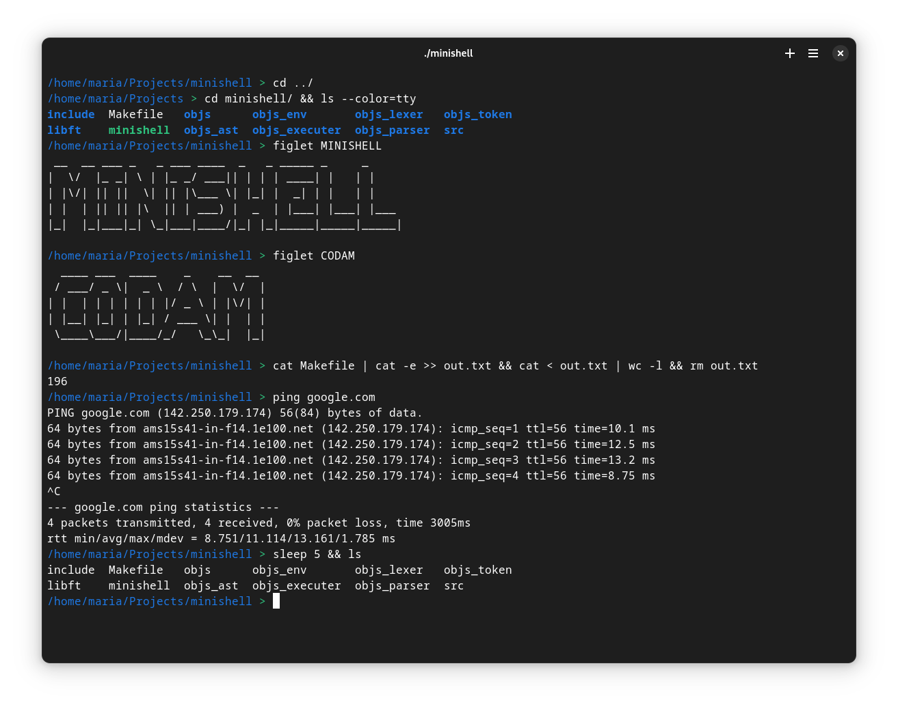

# MINISHELL

  

## This is a group project from Codam Academy, representing a partial implementation of the Bash shell. It is designed in C with a focus on minimalism and simplicity. The project leverages libft and a finite state machine for lexical analysis. It provides basic shell functionalities including command execution, input/output redirection, and environment variable handling.